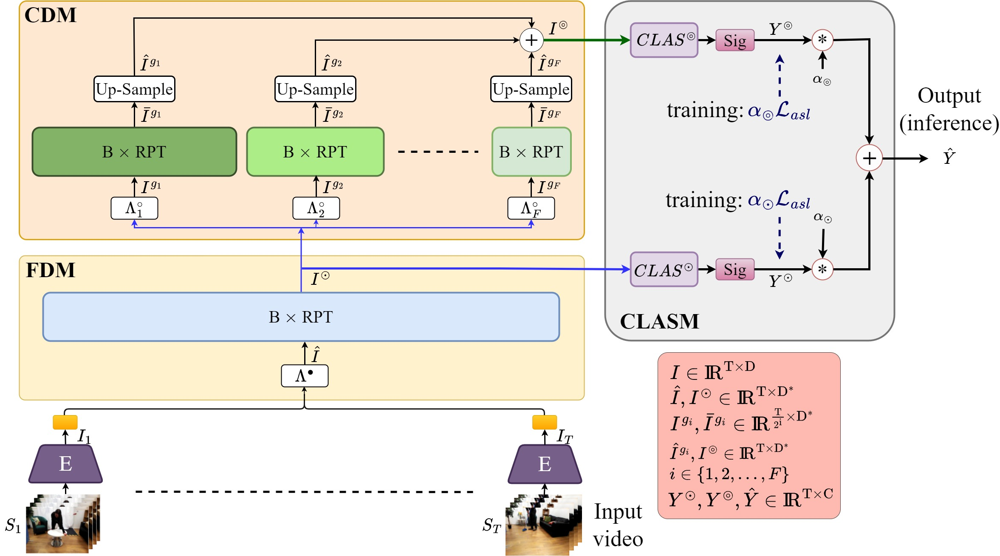

## PAT: Position-Aware Transformer for Dense Multi-Label Action Detection

[Faegheh Sardari](https://scholar.google.com/citations?user=_8dV3CgAAAAJ&hl=en&oi=ao), [Armin Mustafa](https://scholar.google.com/citations?user=0xOHqkMAAAAJ&hl=en), [Philip J.B. Jacksonn](https://scholar.google.com/citations?user=vgue80YAAAAJ&hl=en), [Adrian Hilton](https://scholar.google.com/citations?user=vTIYTNQAAAAJ&hl=en)

Code for ICCVW 2023 paper [PAT: Position-Aware Transformer for Dense Multi-Label Action Detection](https://arxiv.org/abs/2405.1https://openaccess.thecvf.com/content/ICCV2023W/CVEU/papers/Sardari_PAT_Position-Aware_Transformer_for_Dense_Multi-Label_Action_Detection_ICCVW_2023_paper.pdf)

<br><br><br>


## Prerequisites
- Linux 
- Python 3
- CPU or NVIDIA GPU + CUDA CuDNN

## Data Preparation
Following previous works (e.g., MS-TCT), PAT is built on top of pre-trained I3D features. Therefore, you need to extract I3D features for each dataset before both training and inference. To perform this,
1. Download Charades (24 fps version) and MultiTHUMOS datasets from this [link](https://prior.allenai.org/projects/charades) and this [link](https://ai.stanford.edu/~syyeung/everymoment.html), respectively.
2. Follow this [repositorty](https://github.com/piergiaj/pytorch-i3d) to extract their features.

## Train & Test on Charades dataset
bash scripts/run_PAT_Charades.sh

## Train & Test on MultiTHUMOS dataset
bash scripts/run_PAT_MultiTHUMOS.sh

   
[Project](https://github.com/faeghehsardari/colehttps://github.com/faeghehsardari/PAT-ICCVW/tree/main) |  [Paper](https://openaccess.thecvf.com/content/ICCV2023W/CVEU/papers/Sardari_PAT_Position-Aware_Transformer_for_Dense_Multi-Label_Action_Detection_ICCVW_2023_paper.pdhttps://openaccess.thecvf.com/content/ICCV2023W/CVEU/papers/Sardari_PAT_Position-Aware_Transformer_for_Dense_Multi-Label_Action_Detection_ICCVW_2023_paper.pdf)

## Citation
If you use this code for your research, please cite our papers.
```
@inproceedings{sardari2023pat,
  title={PAT: Position-Aware Transformer for Dense Multi-Label Action Detection},
  author={Sardari, Faegheh and Mustafa, Armin and Jackson, Philip JB and Hilton, Adrian},
  booktitle={Proceedings of the IEEE/CVF International Conference on Computer Vision Workshop},
  pages={2988--2997},
  year={2023}
} 
```
## License
Copyright (C) 2024 University of Surrey.
The code repository is published under the CC-BY-NC 4.0 [license](https://creativecommons.org/licenses/by-nc/4.0/deed.en).

## Acknowledgments
This repository includes the modified codes from:
- MS-TCT (CVPR-2022) https://github.com/dairui01/MS-TCT/tree/main?tab=readme-ov-file 

We are grateful to the creators of this repository.

This research is also supported by UKRI EPSRC Platform Grant EP/P022529/1, and EPSRC BBC Prosperity Partnership AI4ME: Future Personalised ObjectBased Media Experiences Delivered at Scale Anywhere EP/V038087/1.
